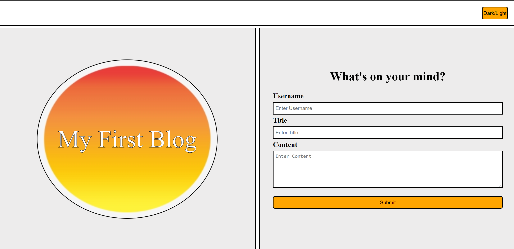
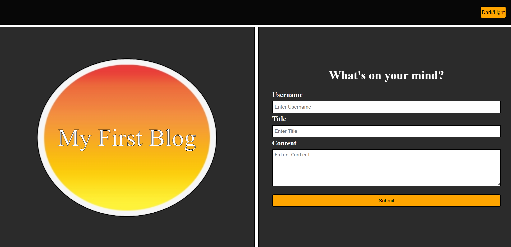
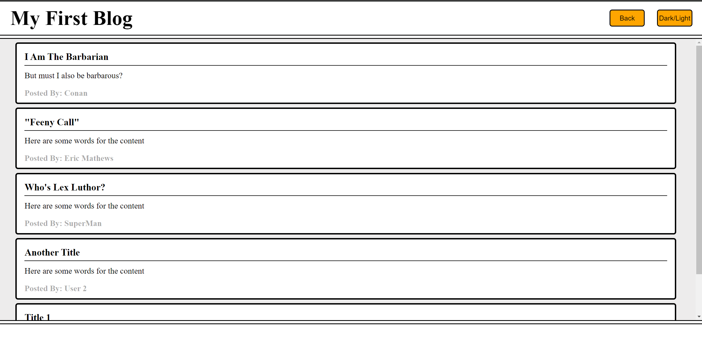
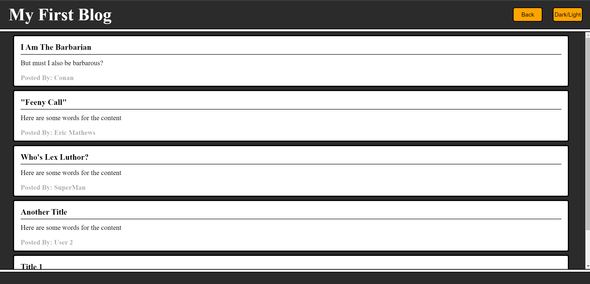

# light-and-dark-4

Description:
This repo is an example of a simple blog style site that allows users to write a blog post and post it to another page, while having prior posts persist over time. It also shows off a rudimentary light and dark mode function.

Installation:
N/A

Usage:
To use this repo, users can fill out the form and have that information displayed on a blog page. Users can also examine the code to learn how to establish creating and utilizing a light and dark mode, how to create objects, save them, and display them to other pages, and basics on how to have information persist over time.

Link to site:
https://stringer-j.github.io/light-and-dark-4/

Credits:
N/A

License:
Refer to the LICENSE in the repo.

Note for grading staff: Xpert Learning Assistant was consulted for various parts of this project, though ultimately a fair amount of the code it gave ended up not being used.